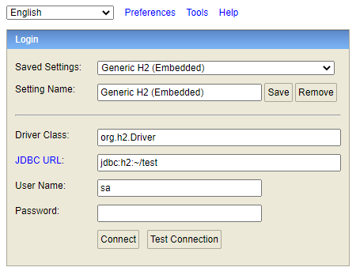
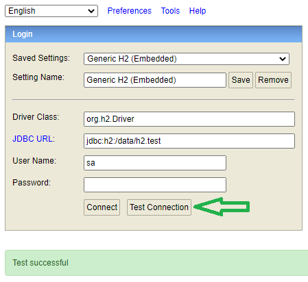
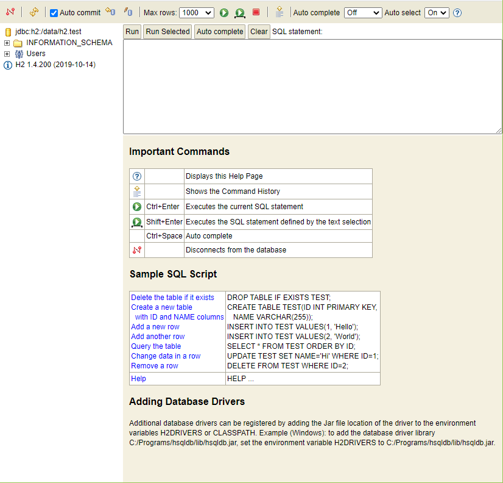

# H2 Docker

This project creates a Docker container image that embeds an H2 database and includes H2 tools such as the [console](https://www.h2database.com/javadoc/org/h2/tools/Console.html?highlight=console&search=console) and [shell](https://www.h2database.com/javadoc/org/h2/tools/Shell.html?highlight=shell&search=shell).

## Quick Start

Clone this repository and then execute the following.

```bash
mvn package docker:build docker:run
```

This will build and run a Docker container that holds H2. Open a browser and navigate to: http://localhost:8080. You will be presented with a login dialog.



The project does not actually create a database but you may do so by attaching to the container and executing the H2 shell to do so.

```bash
docker exec -it h2-docker-1 bash
root@6b2d5d36b53b:/# java -cp h2.jar org.h2.tools.Shell \
  -url jdbc:h2:/data/h2.test -user sa -password test

Welcome to H2 Shell 1.4.200 (2019-10-14)
Exit with Ctrl+C
Commands are case insensitive; SQL statements end with ';'
help or ?      Display this help
list           Toggle result list / stack trace mode
maxwidth       Set maximum column width (default is 100)
autocommit     Enable or disable autocommit
history        Show the last 20 statements
quit or exit   Close the connection and exit

sql> SELECT 1;
1
1
(1 row, 21 ms)
sql> quit
Connection closed
root@3b7fbd9cd4c7:/# ls /data
h2.test.mv.db
```

Test the connection.



You now may connect to the database.



## References

1. [H2 Console](https://www.h2database.com/javadoc/org/h2/tools/Console.html?highlight=console&search=console)
1. [H2 Shell](https://www.h2database.com/javadoc/org/h2/tools/Shell.html?highlight=shell&search=shell)
1. [Creating New Databases](http://www.h2database.com/html/tutorial.html#creating_new_databases)
